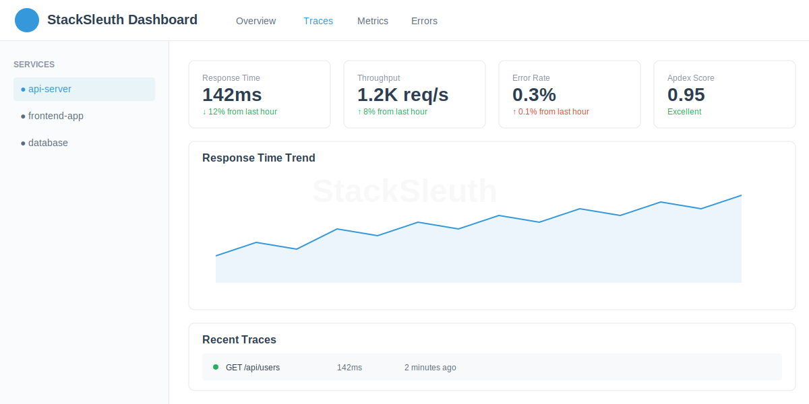
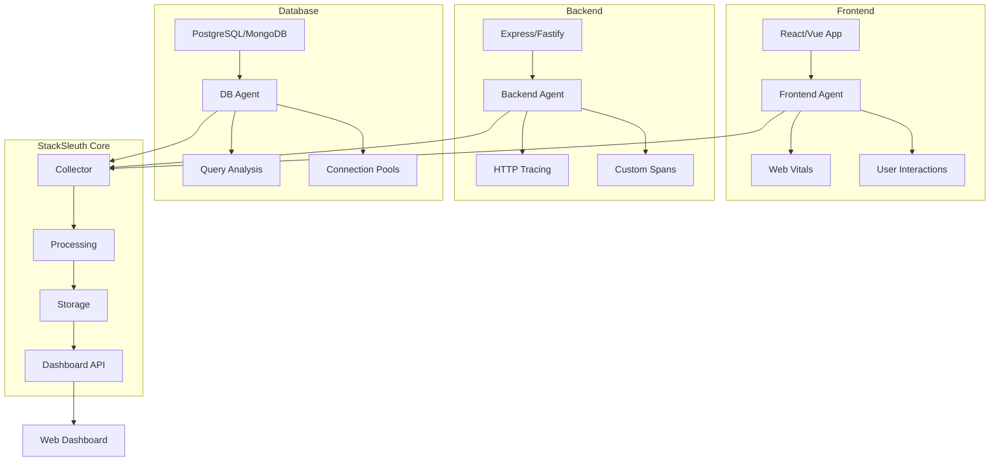

<div align="center">
  
  
  # StackSleuth
  
  ### 🚀 Open-Source Performance Monitoring for Modern Applications
  
  [](https://www.npmjs.com/package/@stacksleuth/core)
  [](https://opensource.org/licenses/MIT)
  [](https://www.typescriptlang.org/)
  [](https://nodejs.org/)
  [](https://github.com/jackulau/StackSleuth/actions)
  
  **Real-time performance profiling • Database monitoring • Framework agnostic • Production ready**

  [📚 Documentation](https://jackulau.github.io/StackSleuth/) • 
  [🎯 Live Demo](https://jackulau.github.io/StackSleuth/dashboard.html) • 
  [📦 NPM Packages](https://www.npmjs.com/org/stacksleuth) • 
  [🚀 Quick Start](#-quick-start)
  
</div>

---

## ✨ Why StackSleuth?

StackSleuth is a **comprehensive performance monitoring solution** that gives you complete visibility into your application's performance across the entire stack. Unlike traditional APM tools, StackSleuth is:

- **🆓 100% Open Source** - No vendor lock-in, full transparency
- **⚡ Lightweight** - Less than 5% overhead with intelligent sampling
- **🎯 Developer-First** - Built by developers, for developers
- **🔄 Real-Time** - Live performance data with instant insights
- **📊 Visual** - Beautiful dashboards with actionable metrics

## 🎯 Key Features

<table>
<tr>
<td width="50%">

### 🔍 Distributed Tracing
Complete request flow visualization across services, databases, and frontend components

### 📊 Performance Metrics
- Response times & throughput
- Database query analysis
- Memory & CPU usage
- Error rates & patterns

### 🎨 Interactive Dashboard
- Real-time waterfall charts
- Flamegraphs & call trees
- Performance trends
- Custom alerts

</td>
<td width="50%">

### 🏗️ Multi-Framework Support
- **Frontend:** React, Vue, Svelte, Angular
- **Backend:** Express, Fastify, Koa, Hapi
- **Database:** PostgreSQL, MySQL, MongoDB, Redis
- **Runtime:** Node.js, Deno, Bun

### 🤖 Smart Detection
- N+1 query detection
- Memory leak identification
- Slow endpoint analysis
- Bundle size tracking

### 🔧 Developer Tools
- CLI with live monitoring
- VS Code extension
- Chrome DevTools integration
- CI/CD performance gates

</td>
</tr>
</table>

## 📦 Quick Start

### 1️⃣ Install the CLI

```bash
npm install -g @stacksleuth/cli
# or
yarn global add @stacksleuth/cli
# or
pnpm add -g @stacksleuth/cli
```

### 2️⃣ Initialize Your Project

```bash
cd your-project
sleuth init

# Non-interactive mode
sleuth init --yes
```

### 3️⃣ Start Monitoring

```bash
sleuth watch

# With custom port
sleuth watch --port 4000

# With timeout for CI/CD
sleuth watch --timeout 60
```

Visit `http://localhost:3001` to see your performance dashboard! 🎉

## 🛠️ Framework Integration

### Express.js Backend

```typescript
import express from 'express';
import { BackendAgent } from '@stacksleuth/backend-agent';

const app = express();
const agent = new BackendAgent({
  serviceName: 'api-server',
  sampleRate: 0.1 // 10% sampling in production
});

// Auto-instrument all routes
agent.instrument(app);

// Manual tracing for specific operations
app.get('/api/users', async (req, res) => {
  const users = await agent.trace('db.users.findAll', async () => {
    return await User.findAll();
  });
  res.json(users);
});

agent.startMonitoring();
```

### React Frontend

```tsx
import { StackSleuthProvider, usePerformance } from '@stacksleuth/frontend-agent';

function App() {
  return (
    <StackSleuthProvider config={{
      endpoint: 'http://localhost:3001',
      enableWebVitals: true,
      trackUserInteractions: true
    }}>
      <YourApp />
    </StackSleuthProvider>
  );
}

function UserDashboard() {
  const { trace, measureRender } = usePerformance();
  
  // Automatic render tracking
  measureRender('UserDashboard');
  
  const loadData = async () => {
    await trace('api.fetchUsers', async () => {
      const res = await fetch('/api/users');
      return res.json();
    });
  };
  
  return <div>...</div>;
}
```

### Vue.js Frontend

```vue
<script setup>
import { useStackSleuth } from '@stacksleuth/vue-agent';

const { trace, tracedRef } = useStackSleuth();

// Traced reactive data
const users = tracedRef([], 'users-list');

// Trace async operations
const fetchUsers = async () => {
  await trace('api.fetchUsers', async () => {
    const response = await fetch('/api/users');
    users.value = await response.json();
  });
};
</script>
```

### Database Monitoring

```typescript
// PostgreSQL
import { instrumentPg } from '@stacksleuth/db-agent';
import { Pool } from 'pg';

const pool = instrumentPg(new Pool(config), {
  slowQueryThreshold: 100, // ms
  logQueryParameters: false // Privacy first
});

// MongoDB
import { instrumentMongoDB } from '@stacksleuth/mongodb-agent';
import { MongoClient } from 'mongodb';

const client = instrumentMongoDB(new MongoClient(uri), {
  trackAggregations: true,
  slowOpThreshold: 50
});

// MySQL
import { MySQLAgent } from '@stacksleuth/mysql-agent';

const agent = new MySQLAgent({
  host: 'localhost',
  slowQueryThreshold: 100,
  enablePerformanceSchema: true
});
```

## 📊 Performance Dashboard

<div align="center">
  
</div>

The StackSleuth dashboard provides:

- **🔄 Real-time Updates** - Live performance data streaming
- **📈 Waterfall Charts** - Request timeline visualization
- **🔥 Flamegraphs** - CPU profiling and call stacks
- **📊 Metrics Graphs** - Response times, throughput, errors
- **🔍 Trace Explorer** - Detailed request inspection
- **⚠️ Alert Management** - Custom performance thresholds
- **📱 Responsive Design** - Works on mobile devices

## 🏗️ Architecture



## 📦 Package Ecosystem

| Package | Version | Description |
|---------|---------|-------------|
| [`@stacksleuth/core`](packages/core) |  | Core profiling engine and types |
| [`@stacksleuth/cli`](packages/cli) |  | Command-line interface & dashboard |
| [`@stacksleuth/backend-agent`](packages/backend-agent) |  | Node.js backend instrumentation |
| [`@stacksleuth/frontend-agent`](packages/frontend-agent) |  | React performance monitoring |
| [`@stacksleuth/vue-agent`](packages/vue-agent) |  | Vue.js performance tracking |
| [`@stacksleuth/svelte-agent`](packages/svelte-agent) |  | Svelte instrumentation |
| [`@stacksleuth/db-agent`](packages/db-agent) |  | PostgreSQL monitoring |
| [`@stacksleuth/mongodb-agent`](packages/mongodb-agent) |  | MongoDB instrumentation |
| [`@stacksleuth/mysql-agent`](packages/mysql-agent) |  | MySQL query tracking |
| [`@stacksleuth/redis-agent`](packages/redis-agent) |  | Redis command monitoring |

## 🔧 Advanced Configuration

```javascript
// stacksleuth.config.js
export default {
  // Service identification
  service: {
    name: 'my-app',
    version: '1.0.0',
    environment: process.env.NODE_ENV
  },
  
  // Performance sampling
  sampling: {
    rate: process.env.NODE_ENV === 'production' ? 0.01 : 1.0,
    adaptive: true, // Auto-adjust based on load
    maxTracesPerSecond: 100
  },
  
  // Data filtering
  filters: {
    excludeUrls: [/health/, /metrics/],
    excludeHeaders: ['authorization', 'cookie'],
    minDuration: 10 // ms
  },
  
  // Output configuration
  output: {
    console: process.env.NODE_ENV !== 'production',
    dashboard: {
      enabled: true,
      port: 3001,
      host: '0.0.0.0'
    },
    export: {
      format: 'otlp', // OpenTelemetry Protocol
      endpoint: process.env.OTEL_EXPORTER_OTLP_ENDPOINT
    }
  },
  
  // Performance thresholds
  thresholds: {
    responseTime: 1000, // ms
    errorRate: 0.01, // 1%
    apdex: 0.95
  }
};
```

## 🚀 Performance Best Practices

### 1. Use Sampling in Production
```javascript
const agent = new BackendAgent({
  sampleRate: 0.01, // Sample 1% of requests
  adaptive: true     // Increase sampling during incidents
});
```

### 2. Custom Business Metrics
```javascript
agent.recordMetric('checkout.completed', 1, {
  amount: 99.99,
  currency: 'USD',
  items: 3
});
```

### 3. Error Context
```javascript
try {
  await riskyOperation();
} catch (error) {
  agent.recordError(error, {
    userId: req.user.id,
    operation: 'payment.process',
    context: { orderId: order.id }
  });
}
```

### 4. Feature Flags Integration
```javascript
const feature = await trace('feature-flag.check', async () => {
  return await featureFlags.isEnabled('new-checkout');
});
```

## 📈 Benchmarks

Performance overhead measured on a typical Express.js application:

| Scenario | Without StackSleuth | With StackSleuth | Overhead |
|----------|---------------------|------------------|----------|
| Simple GET | 2.1ms | 2.2ms | +4.7% |
| Database Query | 45ms | 46ms | +2.2% |
| Complex API | 150ms | 154ms | +2.6% |
| Static Files | 0.8ms | 0.8ms | +0% |

*Benchmarked on Node.js 20.x with 100% sampling rate*

## 🤝 Contributing

We love contributions! See [CONTRIBUTING.md](CONTRIBUTING.md) for guidelines.

### Development Setup

```bash
# Clone the repository
git clone https://github.com/jackulau/StackSleuth.git
cd StackSleuth

# Install dependencies
npm install

# Build all packages
npm run build

# Run tests
npm test

# Start development mode
npm run dev
```

### Running Examples

```bash
# Full-stack demo
cd examples/fullstack-demo
docker-compose up
npm run dev

# Individual framework examples
cd examples/react-demo && npm start
cd examples/vue-demo && npm run dev
cd examples/express-demo && npm start
```

## 📚 Documentation

- [Getting Started Guide](https://jackulau.github.io/StackSleuth/getting-started.html)
- [API Reference](https://jackulau.github.io/StackSleuth/api-reference.html)
- [Configuration Options](https://jackulau.github.io/StackSleuth/configuration.html)
- [Examples & Tutorials](https://jackulau.github.io/StackSleuth/examples.html)
- [Troubleshooting](https://jackulau.github.io/StackSleuth/troubleshooting.html)

## 🏆 Comparisons

| Feature | StackSleuth | New Relic | DataDog | AppDynamics |
|---------|------------|-----------|---------|-------------|
| Open Source | ✅ | ❌ | ❌ | ❌ |
| Self-Hosted | ✅ | ❌ | ❌ | ❌ |
| Real-time Dashboard | ✅ | ✅ | ✅ | ✅ |
| Distributed Tracing | ✅ | ✅ | ✅ | ✅ |
| Database Monitoring | ✅ | ✅ | ✅ | ✅ |
| Frontend RUM | ✅ | ✅ | ✅ | ✅ |
| Custom Metrics | ✅ | ✅ | ✅ | ✅ |
| AI Insights | 🚧 | ✅ | ✅ | ✅ |
| Price | Free | $$$$ | $$$$ | $$$$ |

## 🛡️ Security

- **No data leaves your infrastructure** - Complete data sovereignty
- **Privacy-first design** - Automatic PII filtering
- **Secure by default** - TLS encryption, auth support
- **Compliance ready** - GDPR, HIPAA compatible

Report security vulnerabilities to: security@stacksleuth.dev

## 📄 License

MIT License - see [LICENSE](LICENSE) file for details.

## 🙏 Acknowledgments

Built with ❤️ using:
- [OpenTelemetry](https://opentelemetry.io/) for observability standards
- [Chart.js](https://www.chartjs.org/) for visualization
- [TypeScript](https://www.typescriptlang.org/) for type safety
- [React](https://reactjs.org/) for the dashboard UI

## 🌟 Star History

[](https://star-history.com/#jackulau/StackSleuth&Date)

---

<div align="center">
  
  **[Website](https://jackulau.github.io/StackSleuth/)** • 
  **[Documentation](https://jackulau.github.io/StackSleuth/)** • 
  **[Examples](examples/)** • 
  **[Changelog](CHANGELOG.md)**
  
  Made with ⚡ by the StackSleuth Team
  
</div>